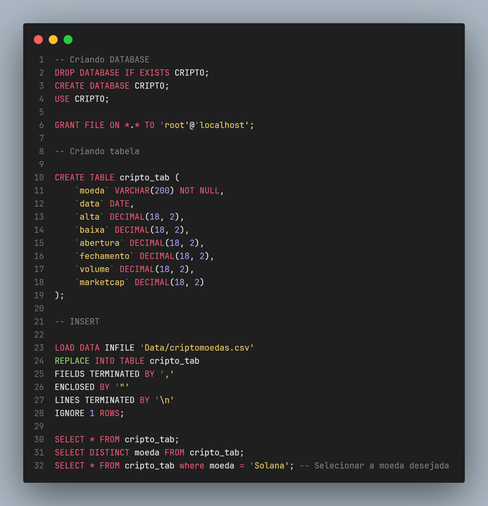

<h1 align="center">
 
</h1>

# Projeto 5 - Criptomoedas

## Conteúdo do Projeto
- [Projeto 5 - Criptomoedas](#projeto-5---criptomoedas)
  - [Conteúdo do Projeto](#conteúdo-do-projeto)
  - [Contexto](#contexto)
  - [Estrutura do Projeto](#estrutura-do-projeto)
  - [PDF do Projeto](#pdf-do-projeto)
  - [Requisitos](#requisitos)
  - [Resultados das Análises](#resultados-das-análises)
  - [***DashBoard***](#dashboard)
  - [Downloads](#downloads)
- [🤝 Colaboradores 🤝](#-colaboradores-)

## Contexto

Nesse projeto estamos analisando criptomoedas, para entender seus padrões de valorização, desvalorização e possíveis correlações entre elas. Trabalhamos com uma corretora financeira, utilizando dados históricos disponíveis no [Kaggle](https://www.kaggle.com/datasets/sudalairajkumar/cryptocurrencypricehistory), buscando insights sobre esses ativos digitais.

## Estrutura do Projeto

- `Data/`: Pasta contendo os arquivos de dados e arquivos para o funcionamento do README.
- `Doc/`: Contém os PDFs do trabalho e arquivos de teste.
- `README.md`: Documentação principal do projeto.

## PDF do Projeto
- [PDF com Instruções e Detalhes do Projeto](Doc/Projetoemgrupo.pdf)

## Requisitos

- **Python 3.x:** [Download Python](https://www.python.org/downloads/)
- **Pandas:** Instale com `!pip install pandas`
- **NumPy:** Instale com `!pip install numpy`
- **Matplotlib:** Instale com `!pip install matplotlib`

## Resultados das Análises

Os dados foram carregados e tratados através do Python pelo [notebook](Code/crypto_anlys.ipynb), as moedas também são selecionadas, que salva os dados na pasta [Data](Data) e é enviada pelo [index.py](Code/index.py) para a pasta do XAMPP.

O dados são importados para o banco de dados através do [query.sql](Code/query.sql).

As tabelas foram montadas no [Tableau Public Web](https://public.tableau.com/app/profile/cassio.ramos/viz/CriptoMoedas/DashboardCriptomoedas). O arquivo do Tableau foi anexado e pode ser encontrado [aqui](Doc/CriptoMoedas.twbx).

O [PDF](Doc/Projetoemgrupo.pdf) do dashboard pode ser encontrado na pasta [Doc](Doc).

## ***DashBoard***

| Médias | Médias Sem BitCoin |
|-----------|--------------|
| .png) | .png) |

> **Análise de Tendências Anuais:**
>
> Em geral, todas as moedas apresentaram uma tendência de aumento ao longo dos anos, com destaque para a Bitcoin. Os anos de **2017** e **2020** se destacaram por um crescimento expressivo, especialmente para a Bitcoin e a Ethereum. As outras moedas também experimentaram um aumento, mas em uma escala menor em comparação com essas duas.
>
> **Variações Anuais:**
>
> As maiores quedas foram observadas em **2019**, seguidas por um período de baixa até o final de **2020**. Em **2021**, houve um retorno ao crescimento, seguido por uma queda posterior. Esses padrões foram consistentes para todas as moedas analisadas.

---

> **Atraves desse grafico podemos verificar valores de forma mais precisa.**
>
> A **Bitcoin** e a **Ethereum** lideraram em valorização, seguidas pela Aave, que teve um aumento significativo desde sua criação. 
>
> Por outro lado, a **Solana** teve um crescimento mais lento e enfrentou uma queda no final de 2021, enquanto a **Cosmo** teve um dos menores aumentos e o menor valor entre as 10 criptomoedas no final de 2021.
>
>> *Observou-se que quase todas as criptomoedas atingiram seu pico em maio de 2021, com exceção da Bitcoin, que alcançou seu ápice em abril. Isso sugere que, como a Bitcoin é a principal referência do mercado, seu aumento precedeu o crescimento das outras moedas em maio, mostrando uma correlação significativa entre seus movimentos de mercado.*

---

| Soma | Médias |
|-----------|--------------|
| .png) | .png) |

> Analisando se existe alguma tendência de aumento ou queda dos valores pelo dia da semana, observamos que há uma variação mínima e ausência de padrão consistente de acordo com os anos
> 
> Ao examinar o gráfico, notamos uma tendência no ano de **2021**, onde os valores de venda da **Bitcoin** eram mais baixos às **quartas** e **quintas-feiras.** Essa variação pode ser atribuída à presença reduzida desses dias durante esse período específico, como indicado pelo gráfico.
> 
>No entanto, ao calcular a média dos valores, podemos realizar uma análise mais precisa e observamos que **não há uma tendência definida por dia da semana** ao longo dos anos.

---

.png)

> **Dia da Semana com Maior Volume de Negociação:**
>
> - **Bitcoin:** Picos de volume em Sextas-Feiras em 2021.
> - **Ethereum:** Picos em Segundas e Quartas-Feiras em 2021.
> - **Litecoin:** Pico em Quintas-Feiras em 2020; declínio em 2021.

---

.png)

> Observamos uma correlação significativa entre as moedas na maioria dos anos, indicando uma tendência geral de movimento conjunto entre elas.
> 
> Em 2021, houve uma variação na correlação entre as moedas, com algumas apresentando correlações menores do que em anos anteriores. Essa mudança pode ser atribuída à queda no valor da **Bitcoin**, levando os investidores a diversificar seus investimentos em busca de melhores oportunidades. 
> 
> Em resumo, enquanto observamos uma correlação forte entre as moedas em anos anteriores, a diversificação dos investimentos em 2021 levou a uma redução da correlação entre algumas delas.
> 
> As outras medidas e anos podem ser visualizada acessando grafico interativo

---

## Downloads

  
  
  

---

# 🤝 Colaboradores 🤝

<table>
  <tr>
    <td align="center" style="text-align: center;">
      <a href="https://github.com/NewKanvas">
         
        <b>Cássio Ramos</b>
      </a>
       
      <a href="https://github.com/NewKanvas">GitHub</a> |
      <a href="https://www.linkedin.com/in/cassiosramos/">LinkedIn</a>
    </td>
    <td align="center" style="text-align: center;">
      <a href="https://github.com/alsantosad">
         
        <b>Alessandro Brito</b>
      </a>
       
      <a href="https://github.com/alsantosad">GitHub</a> |
      <a href="https://www.linkedin.com/in/alessandrobritoad/">LinkedIn</a>
    </td>
    <td align="center" style="text-align: center;">
      <a href="https://github.com/CezarHick">
         
        <b>Cezar Henrique</b>
      </a>
       
      <a href="https://github.com/CezarHick">GitHub</a> |
      <a href="https://www.linkedin.com/in/cezarh-gomes/">LinkedIn</a>
    </td>
    <td align="center" style="text-align: center;">
      <a href="https://github.com/FelipeDamicoCapitao">
         
        <b>Felipe Damico</b>
      </a>
       
      <a href="https://github.com/FelipeDamicoCapitao">GitHub</a> |
      <a href="#">LinkedIn</a>
    </td>
    <td align="center" style="text-align: center;">
      <a href="https://github.com/dria99">
         
        <b>Drielli Almeida</b>
      </a>
       
      <a href="https://github.com/dria99">GitHub</a> |
      <a href="https://www.linkedin.com/in/drielli-ao/">LinkedIn</a>
    </td>
    <td align="center" style="text-align: center;">
      <a href="https://github.com/DeboraJansen95">
         
        <b>Debora Jansen</b>
      </a>
       
      <a href="https://github.com/DeboraJansen95">GitHub</a> |
      <a href="https://www.linkedin.com/in/debora-jansen/">LinkedIn</a>
    </td>
    <td align="center" style="text-align: center;">
      <a href="https://github.com/jordaozz">
         
        <b>Gabriel Jordão</b>
      </a>
       
      <a href="https://github.com/jordaozz">GitHub</a> |
      <a href="https://www.linkedin.com/in/gabriel-jord%C3%A3o-5aa09a25b/">LinkedIn</a>
    </td>
  </tr>
</table>

  

---

