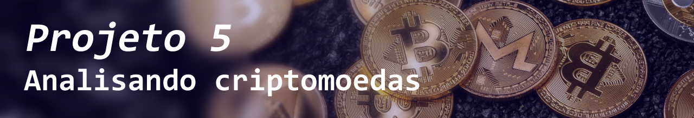

<h1 align="center">
 
</h1>

# Projeto 5 - Criptomoedas

## Conteúdo do Projeto
- [Contexto](#contexto)
- [Estrutura do Projeto](#estrutura-do-projeto)
- [Requisitos](#requisitos)
- [Resultados das Análises](#resultados-das-análises)
- [Download](#download)
- [Integrantes](#integrantes)
- [Status](#status)

## Contexto

Nesso projeto estamos analisando criptomoedas, para entender seus padrões de valorização, desvalorização e possíveis correlações entre elas. Trabalhamos com uma corretora financeira, utilizando dados históricos disponíveis no [Kaggle](https://www.kaggle.com/datasets/sudalairajkumar/cryptocurrencypricehistory), buscando insights sobre esses ativos digitais.

## Estrutura do Projeto

- `Data/`: Pasta contendo os arquivos de dados e arquivos para o funcionamento do README.
- `Doc/`: Contém os PDFs do trabalho e arquivos de teste.
- `README.md`: Documentação principal do projeto.

## PDF do Projeto
- [PDF com Instruções e Detalhes do Projeto](Doc/Material/1694467316_SEDADOSM5Projetoemgrupopdf.pdf)

## Requisitos

- **Python 3.x:** [Download Python](https://www.python.org/downloads/)
- **Pandas:** Instale com `!pip install pandas`
- **NumPy:** Instale com `!pip install numpy`
- **Matplotlib:** Instale com `!pip install matplotlib`

## Resultados das Análises

Os dados foram carregados e tratados atraves do python pelo [notebook](Code/crypto_anlys.ipynb), as moedas tambem sao selecionads  , que salva os dados na pasta [Data](Data) e é enviada pelo [index.py](Code/index.py) para a pasta do XAMPP.

O dados são importados para o banco de dados atraves do [query.sql](Code/query.sql).

As tabelas foram montadas no [Tableau Public Web](https://public.tableau.com/app/profile/cassio.ramos/viz/CriptoMoedas/TradingsPrices#2).

## Download

---
# 🤝 Colaboradores 🤝

<table>
  <tr>
    <td align="center" style="text-align: center;">
      <a href="https://github.com/NewKanvas">
         
        <b>Cássio Ramos</b>
      </a>
       
      <a href="https://github.com/NewKanvas">GitHub</a> |
      <a href="https://www.linkedin.com/in/cassiosramos/">LinkedIn</a>
    </td>
    <td align="center" style="text-align: center;">
      <a href="https://github.com/alsantosad">
         
        <b>Alessandro Brito</b>
      </a>
       
      <a href="https://github.com/alsantosad">GitHub</a> |
      <a href="https://www.linkedin.com/in/alessandrobritoad/">LinkedIn</a>
    </td>
    <td align="center" style="text-align: center;">
      <a href="https://github.com/CezarHick">
         
        <b>Cezar Henrique</b>
      </a>
       
      <a href="https://github.com/CezarHick">GitHub</a> |
      <a href="https://www.linkedin.com/in/cezarh-gomes/">LinkedIn</a>
    </td>
    <td align="center" style="text-align: center;">
      <a href="https://github.com/FelipeDamicoCapitao">
         
        <b>Felipe Damico</b>
      </a>
       
      <a href="https://github.com/FelipeDamicoCapitao">GitHub</a> |
      <a href="#">LinkedIn</a>
    </td>
    <td align="center" style="text-align: center;">
      <a href="https://github.com/dria99">
         
        <b>Drielli Almeida</b>
      </a>
       
      <a href="https://github.com/dria99">GitHub</a> |
      <a href="https://www.linkedin.com/in/drielli-ao/">LinkedIn</a>
    </td>
    <td align="center" style="text-align: center;">
      <a href="https://github.com/DeboraJansen95">
         
        <b>Debora Jansen</b>
      </a>
       
      <a href="https://github.com/DeboraJansen95">GitHub</a> |
      <a href="https://www.linkedin.com/in/debora-jansen/">LinkedIn</a>
    </td>
    <td align="center" style="text-align: center;">
      <a href="https://github.com/jordaozz">
         
        <b>Gabriel Jordão</b>
      </a>
       
      <a href="https://github.com/jordaozz">GitHub</a> |
      <a href="https://www.linkedin.com/in/gabriel-jord%C3%A3o-5aa09a25b/">LinkedIn</a>
    </td>
  </tr>
</table>

  

---

